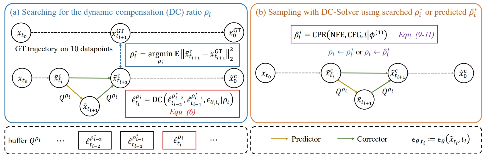
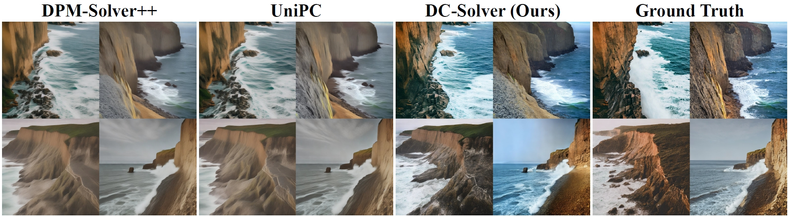

# DC-Solver: Improving Predictor-Corrector Diffusion Sampler via Dynamic Compensation

Created by [Wenliang Zhao](https://wl-zhao.github.io/), [Haolin Wang](https://github.com/howlin-wang), [Jie Zhou](https://scholar.google.com/citations?user=6a79aPwAAAAJ&hl=en&authuser=1), [Jiwen Lu](https://scholar.google.com/citations?user=TN8uDQoAAAAJ&hl=en&authuser=1)

This code contains the PyTorch implementation for DC-Solver (ECCV 2024).

[[arXiv]]()

DC-Solver is designed to improve alignment in predictor-corrector diffusion samplers (while also applicable to predictor-only samplers).



With negligible search costs, DC-Solver can achieve as few as 5 sampling steps (NFE). Here is a comparison of different samplers with only 5 NFE, where the ground truth is obtained by a 999-step DDIM.



DC-Solver can also work in a training-free manner when equipped with the proposed CPR (cascade polynomial regression). Please see the instructions below for details.

## Installation
We implement our DC-Solver in both [Stable-Diffusion](https://github.com/CompVis/stable-diffusion) and [diffusers](https://github.com/huggingface/diffusers). Please follow their instructions to install the environment. Our implementation of DC-Solver for the two codebases is in the `stable-diffusion` and `diffusers` folders, respectively. Please clone their repos and copy our DC-Solver code to the corresponding codebase.

## Usage
### Stable-Diffusion
We take unconditional sampling on FFHQ as an example. Please first prepare the checkpoint on FFHQ using the link provided [here](https://github.com/CompVis/stable-diffusion/blob/main/scripts/download_models.sh). We can then perform the search stage to find the optimal dynamic compensation ratios by:
```
PYTHONPATH=./:$PYTHONPATH \
    python scripts/sample_diffusion_dc_solver.py -r models/ldm/ffhq256/model.ckpt --mode search --custom_steps 5
```
Note that we need to generate the ground truth trajectory using DDIM before the first search. This is automatically done by the above command in the first run and will not incur additional computational costs later.

The dynamic compensation ratios are stored in `dc_solver/dc_ratios/default.json` by default. We can then run the sampling stage by:
```
PYTHONPATH=./:$PYTHONPATH \
python scripts/sample_diffusion_dc_solver.py -r models/ldm/ffhq256/model.ckpt --mode sample --custom_steps 5
```

### Diffusers
We perform experiments of text-to-image generation using the diffusers library. The search stage can be performed by:
```
PYTHONPATH=./src:$PYTHONPATH \
    python scripts/sample_dc_solver.py --mode search --NFE 5 --CFG 7.5
```
We can then run the sampling via:
```
PYTHONPATH=./src:$PYTHONPATH \
    python scripts/sample_dc_solver.py --mode sample --NFE 5 --CFG 7.5
```

We can also use cascade polynomial regression to instantly predict the dynamic compensation ratios for unseen NFE/CFG by passing the `--use_cpr` flag, for example:
```
PYTHONPATH=./src:$PYTHONPATH \
    python scripts/sample_dc_solver.py --mode sample --NFE 6 --CFG 6.0 --use_cpr
```

## Acknowledgement
Our code is based on [UniPC](https://github.com/wl-zhao/UniPC), [Stable-Diffusion](https://github.com/CompVis/stable-diffusion), and [diffusers](https://github.com/huggingface/diffusers). We thank them for their excellent work!

## Citation

If you find our work useful in your research, please consider citing:

```
@article{zhao2024dcsolver,
  title={DC-Solver: Improving Predictor-Corrector Diffusion Sampler via Dynamic Compensation},
  author={Zhao, Wenliang and Wang, Haolin and Zhou, Jie and Lu, Jiwen},
  journal={ECCV},
  year={2024}
}
```